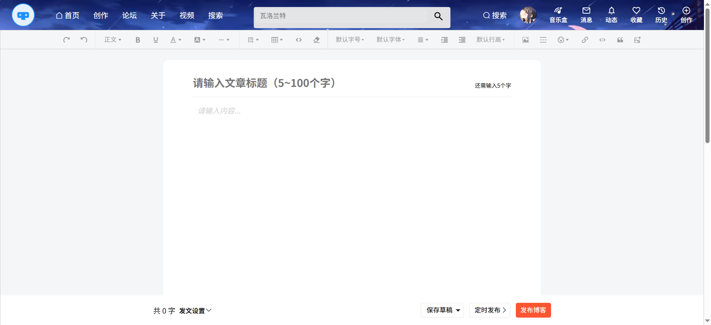
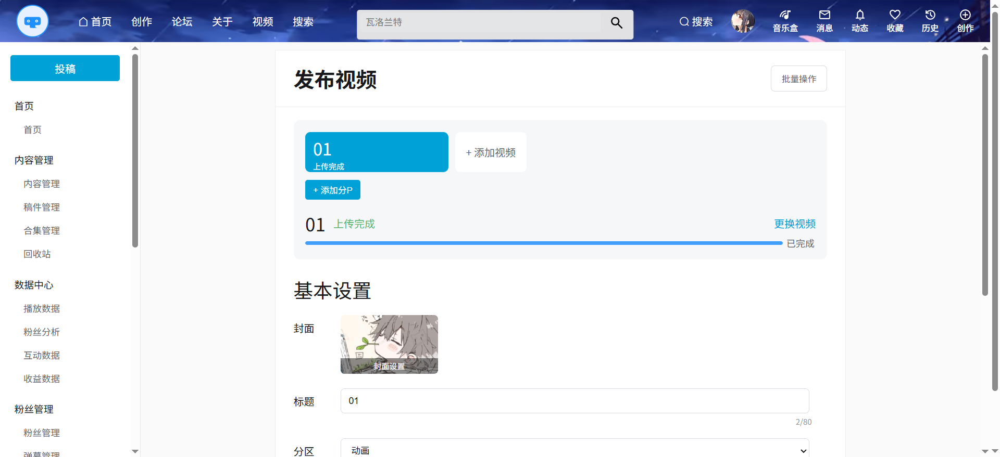

# blog

## 前言

`blog`项目为一个前后端分离的论坛系统，采用现阶段主流技术实现。

## 项目介绍

`blog` 项目是一套论坛系统，基于Spring Boot + Vue 实现，采用前后端分离架构。

在基础论坛功能(发帖，评论，用户中心)的基础上，对系统进行了多维度优化与扩展：

* 引入视频上传与播放功能，支持大文件分片上传，提升内容表现形式。
* 针对大文件上传场景，实现分片上传、并发控制、断点续传及失败重试机制，增强系统在复杂网络环境下的稳定性；
* 集成 Elasticsearch 构建搜索服务，实现帖子内容的全文检索与快速响应，优化搜索体验；

### 项目演示

#### 论坛系统

前端项目`blog` 地址： https://github.com/LuuuMii/gamehub-frontend

### 技术选型

#### 后端技术

| 技术             | 说明             | 官网                                                         |
| :--------------- | ---------------- | :----------------------------------------------------------- |
| SpringBoot       | Web应用开发框架  | [ https://spring.io/projects/spring-boot](https://spring.io/projects/spring-boot) |
| MyBatis          | ORM框架          | [ http://www.mybatis.org/mybatis-3/zh/index.html](http://www.mybatis.org/mybatis-3/zh/index.html) |
| MyBatisGenerator | 数据层代码生成器 | [ http://www.mybatis.org/generator/index.html](http://www.mybatis.org/generator/index.html) |
| Elasticsearch    | 搜索引擎         | [ https://github.com/elastic/elasticsearch](https://github.com/elastic/elasticsearch) |
| RocketMQ         | 消息队列         | https://github.com/apache/rocketmq                           |
| Redis            | 内存数据存储     | [ https://redis.io/](https://redis.io/)                      |
| Kibana           | 可视化查看工具   | [ https://github.com/elastic/kibana](https://github.com/elastic/kibana) |
| OSS              | 对象存储         | https://github.com/aliyun/aliyun-oss-java-sdk                |
| Hutool           | Java工具类库     | https://github.com/looly/hutool                              |
| Sa-Token         | 认证和授权框架   | https://github.com/dromara/sa-token                          |

#### 前端技术

| 技术       | 说明             | 官网                                                         |
| ---------- | ---------------- | ------------------------------------------------------------ |
| Vue        | 前端框架         | [ https://vuejs.org/](https://vuejs.org/)                    |
| Vue-router | 路由框架         | [ https://router.vuejs.org/](https://router.vuejs.org/)      |
| Vuex       | 全局状态管理框架 | [ https://vuex.vuejs.org/](https://vuex.vuejs.org/)          |
| ElementUI  | 前端UI框架       | [ https://element.eleme.io](https://element.eleme.io/)       |
| Axios      | 前端HTTP框架     | [ https://github.com/axios/axios](https://github.com/axios/axios) |
| wangEditor | 富文本编辑器     | https://github.com/wangeditor-team/wangEditor                |
| Artplayer  | 视频播放器       | https://github.com/zhw2590582/ArtPlayer                      |

### 模块介绍

#### 登录模块

#### 帖子编辑模块

#### 帖子页面展示

#### 搜索模块

#### 视频页面

#### 视频上传页面

